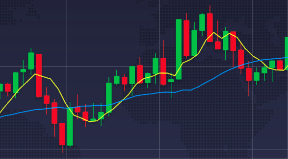
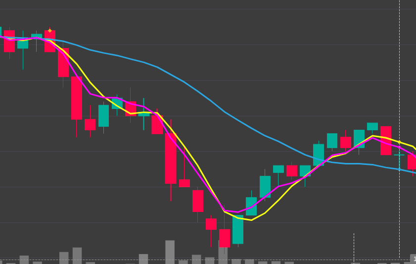

# Globin's Gold

Working in a 5min time frame;

## Strategies

### 2 SMA Crossover
A shorter-term (yellow) and a longer-term (blue) MA. When this shorter-term crosses the longer-term it is a potential signal of trend change.

Shorter-term MA default period: **5**
Longer-term MA default period: **20**

Example:



### 2 Short MA types Crossover(experimental)

A EMA vs SMA shorter-term flowlines crossing each other.

@todo implement tests and description

notes:
seems that PROXIMITY factor can be used to check a uptrend


#### Backtesting report
**Updated at October 11, 2021**

```
======================================================= SELL REASON STATS ========================================================
|        Sell Reason |   Sells |   Win  Draws  Loss  Win% |   Avg Profit % |   Cum Profit % |   Tot Profit BUSD |   Tot Profit % |
|--------------------+---------+--------------------------+----------------+----------------+-------------------+----------------|
|                roi |     432 |    207   225     0   100 |           0.91 |         392.88 |           197.568 |          65.48 |
| trailing_stop_loss |       8 |      0     0     8     0 |         -28.26 |        -226.08 |          -131.698 |         -37.68 |
|         force_sell |       5 |      0     0     5     0 |         -10.09 |         -50.46 |           -25.89  |          -8.41 |


=============== SUMMARY METRICS ================
| Metric                 | Value               |
|------------------------+---------------------|
| Backtesting from       | 2021-08-01 00:00:00 |
| Backtesting to         | 2021-10-07 03:05:00 |
| Max open trades        | 6                   |
|                        |                     |
| Total/Daily Avg Trades | 445 / 6.64          |
| Starting balance       | 250.000 BUSD        |
| Final balance          | 289.980 BUSD        |
| Absolute profit        | 39.980 BUSD         |
| Total profit %         | 15.99%              |
| Avg. stake amount      | 50.899 BUSD         |
| Total trade volume     | 22650.242 BUSD      |
|                        |                     |
| Best Pair              | C98/BUSD 27.7%      |
| Worst Pair             | SLP/BUSD -48.08%    |
| Best trade             | IDEX/BUSD 8.39%     |
| Worst trade            | SLP/BUSD -28.64%    |
| Best day               | 10.711 BUSD         |
| Worst day              | -65.491 BUSD        |
| Days win/draw/lose     | 56 / 7 / 5          |
| Avg. Duration Winners  | 1:41:00             |
| Avg. Duration Loser    | 3 days, 19:20:00    |
| Rejected Buy signals   | 285781              |
|                        |                     |
| Min balance            | 251.155 BUSD        |
| Max balance            | 362.661 BUSD        |
| Drawdown               | 112.94%             |
| Drawdown               | 72.681 BUSD         |
| Drawdown high          | 112.661 BUSD        |
| Drawdown low           | 39.980 BUSD         |
| Drawdown Start         | 2021-09-19 00:45:00 |
| Drawdown End           | 2021-10-07 03:05:00 |
| Market change          | 89.73%              |
================================================
```